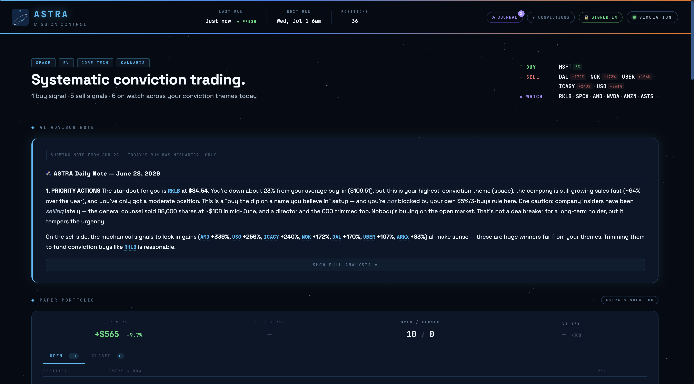
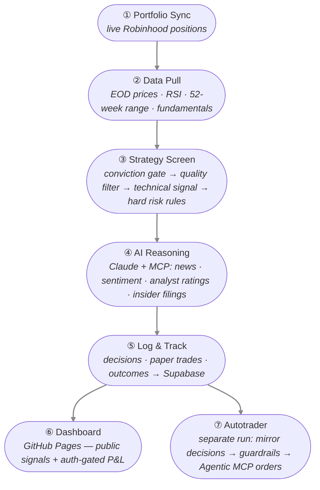
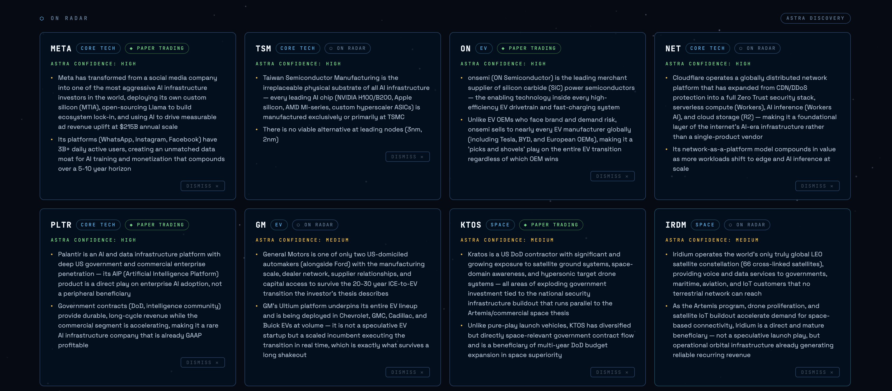

# Trading Advisor: Astra

  

**ASTRA** (AI-powered Stock Trading & Reasoning Agent) is a conviction-based trading advisor that progressively earns autonomy through demonstrated performance. Named for the Latin _ad astra_ — "to the stars" — it began as a way to systematize a space- and tech-heavy investment thesis, and it does not replace human judgment so much as enforce it.

The premise: most investors hold informed sector theses but execute them inconsistently — buying on impulse, averaging down into broken names, letting winners and conviction drift apart. ASTRA acts as a disciplined co-pilot. It screens the portfolio every day, surfaces entry and exit signals, and reasons over live market data and news — advising on the full portfolio (paper-traded; I execute by hand) while trading a small, sandboxed account with real money, autonomously. Autonomy over that sandboxed account is earned through results, and grows only in capital — never into the full portfolio.

  

**Live dashboard:** [abhi-kirk.github.io/Astra](https://abhi-kirk.github.io/Astra/)

> This is a personal project, not a product.

---

## Motivation

I hold strong, long-horizon convictions across a handful of sectors. What I lacked was discipline in acting on them. Manual investing tends to drift: dips get bought emotionally rather than systematically, losers get averaged down past the point of sense, and there is no record connecting a decision to its eventual outcome.

ASTRA exists to close that gap. The goal is not to out-trade the market on speed or to chase headlines — it is to **execute an existing thesis with consistency**, to enforce hard risk rules that emotion tends to override, and to keep an honest, queryable history of every signal and its forward return. The bar for success is simple: beat my own discretionary track record.

---

## How ASTRA Works

ASTRA runs an automated pipeline every weekday morning via GitHub Actions:

Every position resolves to one signal: **BUY · SELL · WATCH · HOLD · BLOCKED**. On the full portfolio a BUY opens a fractional paper trade automatically; it closes when the signal changes — building a live, auditable track record. The same signals, filtered through code-enforced guardrails, drive the **Autotrader** — autonomous real-money orders on a small, sandboxed account. A separate weekly **discovery** run searches within each conviction theme for new names ASTRA hasn't seen, scores its own confidence in them, and surfaces the strongest as candidates.

  

---

## Strategy

ASTRA's screening framework is a funnel — a ticker has to clear every layer before it earns a BUY:

1. **Conviction gate** — the name must belong to an approved conviction theme. Themes, member tickers, and per-ticker intent (thesis hold / opportunistic / written off) live in a convictions store that I edit directly from the dashboard. Positions flagged hold-only or written-off are blocked from new buys regardless of how attractive the technicals look.

2. **Quality filter** — fundamental screen on revenue growth, margins, balance-sheet health, and cash flow, with hard disqualifiers for deteriorating businesses. The aim is to avoid value traps: cheap because it's broken is not the same as cheap because it's out of favor.

3. **Technical entry** — a meaningful dip from the 52-week high combined with an oversold momentum reading. Both conditions signal a BUY; one alone is only a WATCH.

4. **Hard risk rules** — non-negotiable guardrails enforced in code, not just prompted: caps on averaging down into losers, single-name and single-theme concentration limits, and a profit-take review trigger on large unrealized gains. These exist specifically to override the emotional decisions that hurt discretionary investing.

The AI layer never overrides the mechanical signal unilaterally. The deterministic screen decides what is actionable; Claude adds narrative context — news, sentiment, analyst and insider activity — so a human can make the final call with full information.

---

## Architecture

| Layer | Tech |
|---|---|
| Language | Python |
| Market data | yfinance (EOD prices, RSI, fundamentals) |
| Portfolio | Live Robinhood sync (encrypted, auto-rotating OAuth tokens) |
| Autonomous execution | Robinhood Agentic MCP (official) — code-enforced guardrails on a small, sandboxed real-money account |
| Database | Supabase (Postgres) — decisions, paper trades, agent trades, outcomes, run summaries |
| AI reasoning | Anthropic API · Claude · Mustache prompt templates |
| Enrichment (MCP) | Tavily (news) · Alpha Vantage (sentiment, earnings) · SEC EDGAR (insider filings) · FMP (analyst ratings) |
| Automation | GitHub Actions — daily analysis + weekly discovery |
| Dashboard | GitHub Pages — public signals + auth-gated P&L |

### Interaction modes

- **Conviction Update** — edit themes, tickers, and intent from an auth-gated dashboard drawer; every save is snapshotted for audit.
- **Daily Analysis** — the automated pipeline; outputs flow to Supabase and the dashboard.
- **Advisor review** — walk through the day's recommendations on the full portfolio; I execute by hand.
- **Autotrader** — autonomous execution on the sandboxed account; controlled by a dashboard pause/resume switch and code-enforced guardrails, not per-trade approval.

### Privacy

The dashboard serves two tiers. **Public** visitors see tickers, signals, and scrubbed reasoning. **Authenticated** (just me) unlocks the full advisor note, cost basis, P&L, suggested sizing, paper-trade performance, and the Autotrader's live trades, P&L, and controls. Row-level security is enforced server-side, so private data never reaches an unauthenticated browser.

---

## Roadmap

ASTRA runs two permanent parallel tracks: an **Advisor** that paper-trades the full portfolio and advises (I execute by hand), and an **Autotrader** that trades a small, sandboxed account autonomously. The full portfolio is never auto-traded — as the track record justifies, the Autotrader's *capital* grows, not its reach.

| Phase | Goal | Status |
|---|---|---|
| **1** | Simulation — data pipeline, strategy engine, AI reasoning, logging, dashboard | Complete ✅ |
| **1.5** | Daily runs · MCP-enriched analysis · paper trading · discovery engine · trade journal | Complete ✅ |
| **2** | Autotrader live — small sandboxed account traded autonomously | In progress ⏳ |
| **3** | Scale the sleeve — more capital + limits in the autonomous account | Future |
| **4** | Larger autonomous sleeve at steady state — full portfolio stays advisory | Future |

ASTRA earns the right to sell exactly as it earns the right to buy — gradually, through demonstrated performance.
